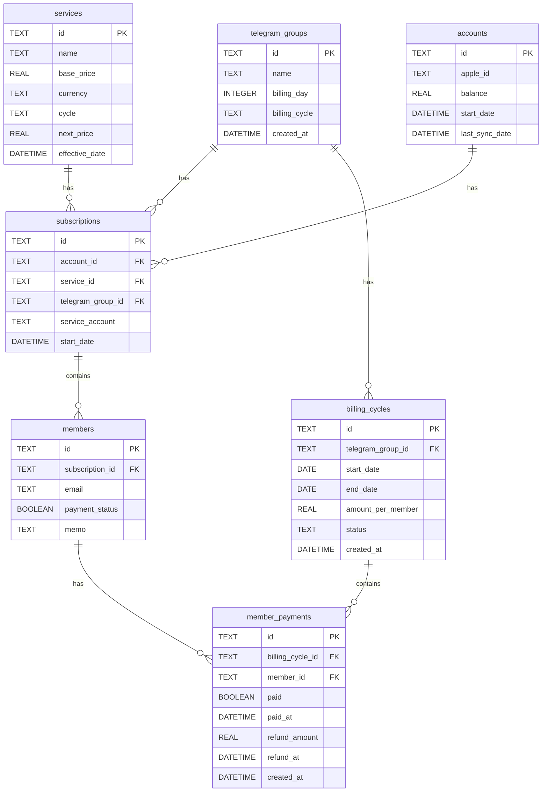
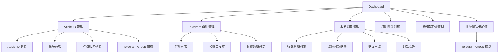
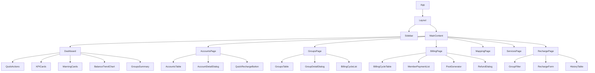

# Apple ID 管理系統架構設計文檔

## 文檔信息

- **版本**: 1.0
- **日期**: 2026-05-21
- **作者**: Zoo (Architect Mode)
- **狀態**: 待審核

## 1. 概述

### 1.1 背景

現有的 SubscriptionManager 系統需要重新設計，使用 Chakra UI v3 來改善 UI/UX，並增加 Telegram Group 關聯功能。

### 1.2 需求摘要

1. **Apple ID 管理頁面** - 顯示所有 Apple ID、餘額、訂閱服務
2. **Telegram Group 關聯** - 每個訂閱服務可以關聯一個 Telegram group
3. **團訂閱狀態查看** - 管理員可以快速查看每個團的訂閱狀態
4. **批次加值功能** - 支援批次加值，可按 Telegram Group 篩選
5. **繁體中文界面** - 所有界面使用繁體中文

### 1.3 技術棧

- **前端框架**: React 19.2.0
- **構建工具**: Vite 7.3.1
- **語言**: TypeScript
- **UI 框架**: Chakra UI v3（替換 Tailwind CSS）
- **路由**: React Router DOM
- **數據獲取**: SWR
- **圖表**: Recharts
- **後端**: Cloudflare Workers
- **數據庫**: SQLite (D1)

---

## 2. 數據模型設計

### 2.1 現有數據模型

```sql
-- 現有表結構
CREATE TABLE IF NOT EXISTS services (
  id TEXT PRIMARY KEY,
  name TEXT NOT NULL,
  base_price REAL NOT NULL,
  currency TEXT NOT NULL,
  cycle TEXT CHECK(cycle IN ('monthly', 'yearly')) NOT NULL,
  next_price REAL,
  effective_date DATETIME
);

CREATE TABLE IF NOT EXISTS accounts (
  id TEXT PRIMARY KEY,
  apple_id TEXT,
  balance REAL DEFAULT 0,
  start_date DATETIME,
  last_sync_date DATETIME
);

CREATE TABLE IF NOT EXISTS subscriptions (
  id TEXT PRIMARY KEY,
  account_id TEXT NOT NULL,
  service_id TEXT NOT NULL,
  start_date DATETIME,
  FOREIGN KEY (account_id) REFERENCES accounts(id),
  FOREIGN KEY (service_id) REFERENCES services(id)
);

CREATE TABLE IF NOT EXISTS members (
  id TEXT PRIMARY KEY,
  subscription_id TEXT,
  email TEXT NOT NULL,
  payment_status BOOLEAN DEFAULT 0,
  memo TEXT
);

CREATE TABLE IF NOT EXISTS history (
  id TEXT PRIMARY KEY,
  account_id TEXT NOT NULL,
  type TEXT CHECK(type IN ('recharge', 'deduction', 'adjustment')) NOT NULL,
  amount REAL NOT NULL,
  created_at DATETIME DEFAULT CURRENT_TIMESTAMP,
  memo TEXT,
  FOREIGN KEY (account_id) REFERENCES accounts(id)
);
```

### 2.2 新增數據模型

#### 2.2.1 telegram_groups 表

```sql
CREATE TABLE IF NOT EXISTS telegram_groups (
  id TEXT PRIMARY KEY,                    -- Telegram Group ID
  name TEXT NOT NULL,                     -- Telegram Group 名稱
  billing_day INTEGER,                    -- 扣費日（1-31）
  billing_cycle TEXT CHECK(billing_cycle IN ('monthly', 'biannually', 'yearly')),  -- 收費週期
  created_at DATETIME DEFAULT CURRENT_TIMESTAMP
);
```

**欄位說明**：

| 欄位 | 類型 | 說明 |
|---|---|---|
| `id` | TEXT | Telegram Group ID（主鍵） |
| `name` | TEXT | Telegram Group 名稱 |
| `billing_day` | INTEGER | 扣費日（1-31） |
| `billing_cycle` | TEXT | 收費週期（monthly/biannually/yearly） |
| `created_at` | DATETIME | 創建時間 |

#### 2.2.2 billing_cycles 表

```sql
CREATE TABLE IF NOT EXISTS billing_cycles (
  id TEXT PRIMARY KEY,
  telegram_group_id TEXT NOT NULL,
  start_date DATE NOT NULL,              -- 收費開始日期
  end_date DATE NOT NULL,                -- 收費結束日期
  amount_per_member REAL NOT NULL,       -- 每人金額
  status TEXT CHECK(status IN ('active', 'completed', 'refunded')) DEFAULT 'active',
  created_at DATETIME DEFAULT CURRENT_TIMESTAMP,
  FOREIGN KEY (telegram_group_id) REFERENCES telegram_groups(id)
);
```

**欄位說明**：

| 欄位 | 類型 | 說明 |
|---|---|---|
| `id` | TEXT | 收費週期 ID（主鍵） |
| `telegram_group_id` | TEXT | Telegram Group ID（外鍵） |
| `start_date` | DATE | 收費開始日期（如 2026-12-06） |
| `end_date` | DATE | 收費結束日期（如 2027-06-04） |
| `amount_per_member` | REAL | 每人金額 |
| `status` | TEXT | 狀態（active/completed/refunded） |
| `created_at` | DATETIME | 創建時間 |

#### 2.2.3 member_payments 表

```sql
CREATE TABLE IF NOT EXISTS member_payments (
  id TEXT PRIMARY KEY,
  billing_cycle_id TEXT NOT NULL,
  member_id TEXT NOT NULL,
  paid BOOLEAN DEFAULT 0,
  paid_at DATETIME,                      -- 付款時間
  refund_amount REAL,                    -- 退款金額
  refund_at DATETIME,                    -- 退款時間
  created_at DATETIME DEFAULT CURRENT_TIMESTAMP,
  FOREIGN KEY (billing_cycle_id) REFERENCES billing_cycles(id),
  FOREIGN KEY (member_id) REFERENCES members(id)
);
```

**欄位說明**：

| 欄位 | 類型 | 說明 |
|---|---|---|
| `id` | TEXT | 付款記錄 ID（主鍵） |
| `billing_cycle_id` | TEXT | 收費週期 ID（外鍵） |
| `member_id` | TEXT | 成員 ID（外鍵） |
| `paid` | BOOLEAN | 是否已付款 |
| `paid_at` | DATETIME | 付款時間 |
| `refund_amount` | REAL | 退款金額（如果被 Ban） |
| `refund_at` | DATETIME | 退款時間 |
| `created_at` | DATETIME | 創建時間 |

### 2.3 修改現有數據模型

#### 2.3.1 subscriptions 表修改

```sql
-- 新增欄位
ALTER TABLE subscriptions ADD COLUMN telegram_group_id TEXT;
ALTER TABLE subscriptions ADD COLUMN service_account TEXT;

-- 新增外鍵約束
ALTER TABLE subscriptions ADD CONSTRAINT fk_telegram_group 
  FOREIGN KEY (telegram_group_id) REFERENCES telegram_groups(id);
```

**新增欄位說明**：

| 欄位 | 類型 | 說明 |
|---|---|---|
| `telegram_group_id` | TEXT | Telegram Group ID（外鍵） |
| `service_account` | TEXT | 服務特定賬戶（Google ID / Email 等） |

### 2.4 數據模型關係圖



### 2.5 數據遷移策略

#### 2.5.1 遷移步驟

1. 創建 `telegram_groups` 表
2. 創建 `billing_cycles` 表
3. 創建 `member_payments` 表
4. 修改 `subscriptions` 表（新增欄位）
5. 從現有 `subscriptions.group_name` 提取唯一的群組名稱，插入到 `telegram_groups` 表
6. 更新 `subscriptions.telegram_group_id` 欄位
7. 移除廢棄的 `group_name` 欄位

#### 2.5.2 遷移腳本

```sql
-- update_schema_v6.sql

-- Step 1: 創建 telegram_groups 表
CREATE TABLE IF NOT EXISTS telegram_groups (
  id TEXT PRIMARY KEY,
  name TEXT NOT NULL,
  billing_day INTEGER,
  billing_cycle TEXT CHECK(billing_cycle IN ('monthly', 'biannually', 'yearly')),
  created_at DATETIME DEFAULT CURRENT_TIMESTAMP
);

-- Step 2: 創建 billing_cycles 表
CREATE TABLE IF NOT EXISTS billing_cycles (
  id TEXT PRIMARY KEY,
  telegram_group_id TEXT NOT NULL,
  start_date DATE NOT NULL,
  end_date DATE NOT NULL,
  amount_per_member REAL NOT NULL,
  status TEXT CHECK(status IN ('active', 'completed', 'refunded')) DEFAULT 'active',
  created_at DATETIME DEFAULT CURRENT_TIMESTAMP,
  FOREIGN KEY (telegram_group_id) REFERENCES telegram_groups(id)
);

-- Step 3: 創建 member_payments 表
CREATE TABLE IF NOT EXISTS member_payments (
  id TEXT PRIMARY KEY,
  billing_cycle_id TEXT NOT NULL,
  member_id TEXT NOT NULL,
  paid BOOLEAN DEFAULT 0,
  paid_at DATETIME,
  refund_amount REAL,
  refund_at DATETIME,
  created_at DATETIME DEFAULT CURRENT_TIMESTAMP,
  FOREIGN KEY (billing_cycle_id) REFERENCES billing_cycles(id),
  FOREIGN KEY (member_id) REFERENCES members(id)
);

-- Step 4: 修改 subscriptions 表
ALTER TABLE subscriptions ADD COLUMN telegram_group_id TEXT;
ALTER TABLE subscriptions ADD COLUMN service_account TEXT;

-- Step 5: 從現有 group_name 提取群組
INSERT INTO telegram_groups (id, name)
SELECT 
  lower(hex(randomblob(16))),
  DISTINCT group_name
FROM subscriptions
WHERE group_name IS NOT NULL AND group_name != '';

-- Step 6: 更新 subscriptions.telegram_group_id
UPDATE subscriptions
SET telegram_group_id = (
  SELECT tg.id 
  FROM telegram_groups tg 
  WHERE tg.name = subscriptions.group_name
)
WHERE group_name IS NOT NULL;
```

---

## 3. 頁面結構設計

### 3.1 頁面列表

| 頁面 | 路徑 | 說明 |
|---|---|---|
| Dashboard | `/` | 綜合儀表板 |
| Apple ID 管理 | `/accounts` | 顯示所有 Apple ID、餘額、訂閱服務、Telegram Group 關聯 |
| Telegram 群組管理 | `/groups` | 管理所有 Telegram 群組、扣費日、收費週期 |
| 收費週期管理 | `/billing` | 管理收費週期、成員付款狀態、生成貼文 |
| 訂閱關係對應 | `/mapping` | 管理訂閱關係（現有） |
| 服務與定價管理 | `/services` | 管理服務與定價（現有） |
| 批次禮品卡加值 | `/recharge` | 批次加值，支援 Telegram Group 篩選（現有，增強） |

### 3.2 頁面結構圖



### 3.3 頁面功能說明

#### 3.3.1 Apple ID 管理頁面 (`/accounts`)

**功能**：
- 顯示所有 Apple ID 及其餘額
- 顯示每個 Apple ID 的訂閱服務列表
- 顯示每個訂閱服務的 Telegram Group 關聯
- 支持快速加值功能

**界面元素**：
- Apple ID 列表表格
- 餘額顯示卡片
- 訂閱服務列表
- Telegram Group 關聯標籤
- 快速加值按鈕

#### 3.3.2 Telegram 群組管理頁面 (`/groups`)

**功能**：
- 管理所有 Telegram 群組
- 設定扣費日（1-31）
- 設定收費週期（每月/每半年/每年）
- 查看群組統計信息

**界面元素**：
- 群組列表表格
- 扣費日設定對話框
- 收費週期設定對話框
- 群組統計卡片

#### 3.3.3 收費週期管理頁面 (`/billing`)

**功能**：
- 創建新的收費週期（如：12月6日 - 6月4日）
- 記錄成員付款狀態
- 生成格式化貼文（如：✅ 已付款列表）
- 處理退款（被 Ban 成員）

**界面元素**：
- 收費週期列表表格
- 成員付款狀態列表
- 貼文生成器
- 退款對話框

#### 3.3.4 批次禮品卡加值頁面 (`/recharge`)

**功能**：
- 批次加值功能（現有）
- 新增 Telegram Group 篩選功能

**界面元素**：
- Telegram Group 篩選器
- 加值表單
- 歷史記錄表格

---

## 4. 組件架構設計

### 4.1 組件樹結構



### 4.2 新增組件列表

| 組件 | 路徑 | 說明 |
|---|---|---|
| `GroupsSummary` | `src/components/dashboard/GroupsSummary.tsx` | Dashboard 顯示群組統計信息 |
| `AccountsTable` | `src/components/accounts/AccountsTable.tsx` | Apple ID 列表表格 |
| `AccountDetailDialog` | `src/components/accounts/AccountDetailDialog.tsx` | Apple ID 詳情對話框 |
| `QuickRechargeButton` | `src/components/accounts/QuickRechargeButton.tsx` | 快速加值按鈕 |
| `GroupsTable` | `src/components/groups/GroupsTable.tsx` | Telegram 群組列表表格 |
| `GroupDetailDialog` | `src/components/groups/GroupDetailDialog.tsx` | 群組詳情對話框 |
| `BillingCycleList` | `src/components/groups/BillingCycleList.tsx` | 收費週期列表 |
| `BillingCycleTable` | `src/components/billing/BillingCycleTable.tsx` | 收費週期表格 |
| `MemberPaymentList` | `src/components/billing/MemberPaymentList.tsx` | 成員付款狀態列表 |
| `PostGenerator` | `src/components/billing/PostGenerator.tsx` | 貼文生成器 |
| `RefundDialog` | `src/components/billing/RefundDialog.tsx` | 退款對話框 |
| `GroupFilter` | `src/components/recharge/GroupFilter.tsx` | Telegram Group 篩選器 |

### 4.3 組件設計原則

1. **使用 Chakra UI v3 組件**：替換現有的 Tailwind CSS 組件
2. **保持組件單一職責**：每個組件只負責一個功能
3. **支持繁體中文界面**：所有文字使用繁體中文
4. **響應式設計**：支持桌面和移動端

### 4.4 Chakra UI v3 組件映射

| 現有組件 | Chakra UI v3 組件 |
|---|---|
| `Card` | `Box` + `Card` |
| `Button` | `Button` |
| `Dialog` | `Dialog` |
| `Input` | `Input` |
| `Select` | `Select` |
| `Table` | `Table` |
| `Badge` | `Badge` |

---

## 5. API 接口設計

### 5.1 新增 API 接口

#### 5.1.1 Telegram Groups API

**端點**: `/api/telegram-groups`

**方法**:
- `GET` - 獲取所有 Telegram 群組
- `POST` - 創建新群組
- `PUT` - 更新群組
- `DELETE` - 刪除群組

**數據結構**:

```typescript
interface TelegramGroup {
  id: string;
  name: string;
  billing_day: number;
  billing_cycle: 'monthly' | 'biannually' | 'yearly';
  created_at: string;
}

// GET /api/telegram-groups
// Response: TelegramGroup[]

// POST /api/telegram-groups
// Request: Omit<TelegramGroup, 'id' | 'created_at'>
// Response: TelegramGroup

// PUT /api/telegram-groups
// Request: TelegramGroup
// Response: TelegramGroup

// DELETE /api/telegram-groups?id=xxx
// Response: { success: boolean }
```

#### 5.1.2 Billing Cycles API

**端點**: `/api/billing-cycles`

**方法**:
- `GET` - 獲取收費週期列表
- `POST` - 創建新收費週期
- `PUT` - 更新收費週期
- `DELETE` - 刪除收費週期

**數據結構**:

```typescript
interface BillingCycle {
  id: string;
  telegram_group_id: string;
  start_date: string;
  end_date: string;
  amount_per_member: number;
  status: 'active' | 'completed' | 'refunded';
  created_at: string;
}

// GET /api/billing-cycles
// Query: ?group_id=xxx
// Response: BillingCycle[]

// POST /api/billing-cycles
// Request: Omit<BillingCycle, 'id' | 'created_at'>
// Response: BillingCycle

// PUT /api/billing-cycles
// Request: BillingCycle
// Response: BillingCycle

// DELETE /api/billing-cycles?id=xxx
// Response: { success: boolean }
```

#### 5.1.3 Member Payments API

**端點**: `/api/member-payments`

**方法**:
- `GET` - 獲取成員付款記錄
- `POST` - 記錄付款
- `PUT` - 更新付款狀態
- `POST /refund` - 處理退款

**數據結構**:

```typescript
interface MemberPayment {
  id: string;
  billing_cycle_id: string;
  member_id: string;
  paid: boolean;
  paid_at: string | null;
  refund_amount: number | null;
  refund_at: string | null;
  created_at: string;
}

// GET /api/member-payments?billing_cycle_id=xxx
// Response: MemberPayment[]

// POST /api/member-payments
// Request: { billing_cycle_id: string, member_id: string, paid: boolean }
// Response: MemberPayment

// PUT /api/member-payments
// Request: MemberPayment
// Response: MemberPayment

// POST /api/member-payments/refund
// Request: { member_payment_id: string, refund_amount: number }
// Response: MemberPayment
```

#### 5.1.4 Post Generator API

**端點**: `/api/generate-post`

**方法**:
- `POST` - 生成格式化貼文

**數據結構**:

```typescript
// POST /api/generate-post
// Request: { billing_cycle_id: string }
// Response: { post: string }
```

**貼文格式範例**:

```
12月6日 - 6月4日 預繳半年，每人$60
如果被Ban，會按比例退返錢。
==========
1. Carrie ✅
2. Eason ✅
3. Keith ✅
4. Don ✅
5. Jason
```

### 5.2 修改現有 API 接口

#### 5.2.1 Subscriptions API

**修改**: `createSubscription` 和 `updateSubscription`

```typescript
interface Subscription {
  id: string;
  account_id: string;
  service_id: string;
  telegram_group_id: string | null;  // 新增
  service_account: string | null;    // 新增
  start_date: string;
}
```

#### 5.2.2 Recharge API

**修改**: `batchRecharge`

```typescript
interface BatchRechargeRequest {
  account_id: string;
  amount: number;
  memo?: string;
  telegram_group_id?: string;  // 新增：可選的群組篩選
}
```

### 5.3 API 接口列表

| 接口 | 方法 | 說明 |
|---|---|---|
| `/api/telegram-groups` | GET | 獲取所有 Telegram 群組 |
| `/api/telegram-groups` | POST | 創建新群組 |
| `/api/telegram-groups` | PUT | 更新群組 |
| `/api/telegram-groups` | DELETE | 刪除群組 |
| `/api/billing-cycles` | GET | 獲取收費週期列表 |
| `/api/billing-cycles` | POST | 創建新收費週期 |
| `/api/billing-cycles` | PUT | 更新收費週期 |
| `/api/billing-cycles` | DELETE | 刪除收費週期 |
| `/api/member-payments` | GET | 獲取成員付款記錄 |
| `/api/member-payments` | POST | 記錄付款 |
| `/api/member-payments` | PUT | 更新付款狀態 |
| `/api/member-payments/refund` | POST | 處理退款 |
| `/api/generate-post` | POST | 生成格式化貼文 |

---

## 6. 實現步驟

### 6.1 階段一：數據模型遷移

1. 創建數據庫遷移腳本 `update_schema_v6.sql`
2. 執行數據庫遷移
3. 驗證數據遷移結果

### 6.2 階段二：後端 API 開發

1. 創建 Telegram Groups API (`functions/api/telegram-groups.ts`)
2. 創建 Billing Cycles API (`functions/api/billing-cycles.ts`)
3. 創建 Member Payments API (`functions/api/member-payments.ts`)
4. 創建 Post Generator API (`functions/api/generate-post.ts`)
5. 修改 Subscriptions API
6. 修改 Recharge API

### 6.3 階段三：前端 UI 框架遷移

1. 安裝 Chakra UI v3
2. 配置 Chakra UI Provider
3. 創建 Chakra UI 主題
4. 逐步替換現有 Tailwind CSS 組件

### 6.4 階段四：前端頁面開發

1. 創建 Apple ID 管理頁面 (`src/pages/Accounts.tsx`)
2. 創建 Telegram 群組管理頁面 (`src/pages/Groups.tsx`)
3. 創建收費週期管理頁面 (`src/pages/Billing.tsx`)
4. 修改批次禮品卡加值頁面（增加群組篩選）
5. 修改 Dashboard（增加群組統計）

### 6.5 階段五：測試與優化

1. 功能測試
2. 性能優化
3. UI/UX 優化
4. 文檔更新

---

## 7. 風險與挑戰

### 7.1 技術風險

| 風險 | 影響 | 緩解措施 |
|---|---|---|
| Chakra UI v3 學習曲線 | 中 | 提前學習官方文檔，參考範例代碼 |
| 數據遷移失敗 | 高 | 備份數據庫，分步執行遷移 |
| API 接口設計不合理 | 中 | 充分討論需求，設計靈活的接口 |

### 7.2 業務風險

| 風險 | 影響 | 緩解措施 |
|---|---|---|
| 需求變更 | 中 | 採用敏捷開發，快速迭代 |
| 用戶體驗不佳 | 中 | 進行用戶測試，收集反饋 |

---

## 8. 附錄

### 8.1 參考文檔

- [Chakra UI v3 官方文檔](https://chakra-ui.com/)
- [Cloudflare Workers 文檔](https://developers.cloudflare.com/workers/)
- [SQLite D1 文檔](https://developers.cloudflare.com/d1/)

### 8.2 相關文件

- [`schema.sql`](../schema.sql) - 現有數據庫結構
- [`src/lib/api.ts`](../src/lib/api.ts) - 現有 API 接口
- [`update_schema_v2.sql`](../update_schema_v2.sql) - 訂閱表遷移腳本
- [`update_schema_v4.sql`](../update_schema_v4.sql) - 成員遷移腳本

---

**文檔結束**
