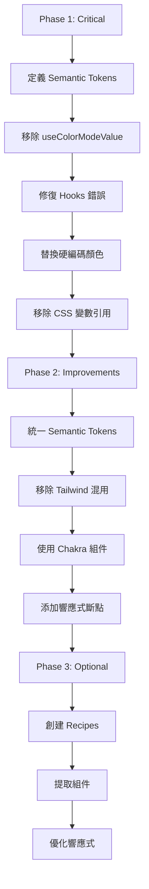

# Chakra UI v3 全系統審查綜合報告

**審查日期**: 2026-05-23  
**審查範圍**: 7 個頁面及相關組件  
**Chakra UI 版本**: v3.35.0  
**框架**: Vite + React

---

## 執行摘要

### 審查範圍統計

| 頁面 | 檔案數 | 總行數 | Critical | Improvements | Optional |
|------|--------|--------|----------|--------------|----------|
| Dashboard | 4 | ~600 | 4 | 8 | 3 |
| Accounts | 3 | ~800 | 3 | 6 | 3 |
| Recharge | 4 | ~700 | 2 | 4 | 2 |
| Services | 1 | ~450 | 0 | 14 | 3 |
| TelegramGroups | 4 | ~970 | 4 | 8 | 3 |
| TelegramGroupDetail | 1 | ~450 | 2 | 8 | 3 |
| Mapping | 1 | ~860 | 5 | 4 | 3 |
| **總計** | **18** | **~4830** | **20** | **52** | **20** |

### 問題總覽

```
┌─────────────────────────────────────────────────────────────┐
│                    問題分布統計                              │
├─────────────────────────────────────────────────────────────┤
│  🔴 Critical    ████████████████████  20 個 (22%)          │
│  🟡 Improvements ████████████████████████████████████████  52 個 (57%) │
│  🟢 Optional     ████████████████████  20 個 (22%)          │
└─────────────────────────────────────────────────────────────┘
```

### 整體評分

| 評分維度 | 分數 | 說明 |
|----------|------|------|
| v3 API 合規性 | ⭐⭐☆☆☆ (2/5) | 大量使用 v2 的 `useColorModeValue` 模式 |
| Semantic Tokens | ⭐☆☆☆☆ (1/5) | 幾乎未使用 semantic tokens |
| Color Mode 支援 | ⭐⭐☆☆☆ (2/5) | 手動處理 color mode，維護困難 |
| Spacing 一致性 | ⭐⭐⭐⭐⭐ (5/5) | 正確使用 token units |
| Accessibility | ⭐⭐⭐⭐☆ (4/5) | 大部分組件有正確的 aria 標籤 |
| **整體評分** | **⭐⭐☆☆☆ (2.8/5)** | 需要全面升級到 v3 模式 |

---

## 全系統共同問題

### 🔴 P0 - Critical 共同問題

#### 1. 使用 v2 的 `useColorModeValue` 模式

**影響範圍**: 100% 的頁面 (7/7)  
**嚴重程度**: Critical  
**問題描述**:

所有頁面都使用了 Chakra UI v2 的 `useColorModeValue` hook，這在 v3 中是反模式。Chakra UI v3 引入了 semantic tokens 系統，顏色會根據 color mode 自動切換。

**問題代碼模式**:

```tsx
// ❌ 錯誤 - v2 模式（在所有 7 個頁面中重複出現）
import { useColorModeValue } from '@/components/ui/color-mode';

const headerBg = useColorModeValue('white', 'bg.subtle');
const headerBorderColor = useColorModeValue('gray.200', 'gray.700');
const headerTitleColor = useColorModeValue('gray.900', 'white');
const headerTextColor = useColorModeValue('gray.600', 'gray.300');
const cardBg = useColorModeValue('white', 'gray.900/40');
const cardBorderColor = useColorModeValue('gray.200', 'gray.700');
const textColor = useColorModeValue('gray.900', 'white');
const secondaryTextColor = useColorModeValue('gray.600', 'gray.300');
// ... 更多重複定義
```

**正確做法**:

```tsx
// ✅ 正確 - v3 semantic tokens
// 移除所有 useColorModeValue 調用
<Box bg="bg.panel" borderColor="border.emphasized">
  <Text color="fg.default">標題</Text>
  <Text color="fg.muted">描述</Text>
</Box>
```

**受影響檔案**:
- [`Dashboard.tsx`](src/pages/Dashboard.tsx:9) - 第 9, 16-30 行
- [`Accounts.tsx`](src/pages/Accounts.tsx:29) - 第 29, 63-72, 206-209 行
- [`Recharge.tsx`](src/pages/Recharge.tsx:33) - 第 33, 41-53 行
- [`Services.tsx`](src/pages/Services.tsx:28) - 第 28, 55-68 行
- [`TelegramGroups.tsx`](src/pages/TelegramGroups.tsx:19) - 第 19, 30-44 行
- [`TelegramGroupDetail.tsx`](src/pages/TelegramGroupDetail.tsx:20) - 第 20, 31-44 行
- [`Mapping.tsx`](src/pages/Mapping.tsx:43) - 第 43, 92-106 行

---

#### 2. 硬編碼顏色值（Hex / RGBA / Palette）

**影響範圍**: 100% 的頁面 (7/7)  
**嚴重程度**: Critical  
**問題描述**:

大量使用硬編碼的顏色值，這些值無法自動適應 dark mode，且違反設計系統原則。

**問題類型統計**:

| 顏色類型 | 出現次數 | 問題 |
|----------|----------|------|
| Hex 值 (如 `#3B82F6`) | 15+ | 無法自動適應 dark mode |
| RGBA 值 (如 `rgba(72, 187, 120, 0.1)`) | 10+ | 透明度硬編碼 |
| Palette 顏色 (如 `gray.900`, `blue.400`) | 100+ | 不會隨 color mode 變化 |
| 帶透明度語法 (如 `gray.900/40`) | 30+ | 語法可能不被正確解析 |

**問題代碼示例**:

```tsx
// ❌ 硬編碼 Hex 值
bg="linear-gradient(90deg, #3B82F6 0%, #8B5CF6 100%)"

// ❌ 硬編碼 RGBA 值
bg="rgba(72, 187, 120, 0.1)"

// ❌ 直接使用 Palette 顏色
color="gray.900"
bg="blue.400"
borderColor="gray.700"

// ❌ 帶透明度語法
bg="gray.900/40"
```

**正確做法**:

```tsx
// ✅ 使用 semantic tokens
bg="gradient.primary"
bg="bg.success.subtle"
color="fg.default"
bg="bg.info"
borderColor="border.muted"
bg="bg.glass"
```

---

#### 3. 動態顏色拼接（模板字符串）

**影響範圍**: 86% 的頁面 (6/7)  
**嚴重程度**: Critical  
**問題描述**:

使用模板字符串動態拼接顏色值，這違反 Chakra v3 的 token 系統原則，且可能導致類型安全問題。

**問題代碼模式**:

```tsx
// ❌ 動態拼接顏色值（在 6 個頁面中出現）
_focus={{ 
    borderColor: inputFocusBorderColor,
    boxShadow: `0 0 0 3px ${inputFocusBorderColor}20`,
}}
```

**正確做法**:

```tsx
// ✅ 使用 Chakra 的 focus ring 系統
_focus={{ 
    borderColor: 'border.focused',
    ring: '2px',
    ringColor: 'blue.400/20',
    ringOffset: '2px'
}}

// 或在 theme 中定義
_focus={{ 
    borderColor: 'border.focused',
    boxShadow: 'focusRing'
}}
```

---

#### 4. Hooks 在渲染週期中被錯誤調用

**影響範圍**: 29% 的頁面 (2/7)  
**嚴重程度**: Critical  
**問題描述**:

在 JSX 屬性中直接調用 `useColorModeValue()`，或在普通函數中調用 hooks，這違反 React Hooks 規則。

**問題位置**:

- [`WarningCard.tsx:51-54`](src/components/dashboard/WarningCard.tsx:51) - 在函數內調用 hooks
- [`TelegramGroupDetail.tsx:355, 364, 398, 408`](src/pages/TelegramGroupDetail.tsx:355) - 在 JSX 屬性中調用 hooks

**問題代碼**:

```tsx
// ❌ 錯誤 - 在函數內調用 hooks
const getWarningColors = (colorPalette: string) => ({
  bg: useColorModeValue(`${colorPalette}.50`, `${colorPalette}.900/20`),
  border: useColorModeValue(`${colorPalette}.200`, `${colorPalette}.500/50`),
});

// ❌ 錯誤 - 在 JSX 屬性中調用 hooks
<Table.Row bg={useColorModeValue('gray.50', 'gray.900')}>
```

**正確做法**:

```tsx
// ✅ 正確 - 直接使用 semantic tokens
const warningColors = {
  red: { bg: 'bg.error', border: 'border.error' },
  orange: { bg: 'bg.warning', border: 'border.warning' },
  yellow: { bg: 'bg.caution', border: 'border.caution' },
};

// ✅ 正確 - 在組件頂層調用
const tableRowBg = useColorModeValue('gray.50', 'gray.900');
// 然後在 JSX 中使用
<Table.Row bg={tableRowBg}>
```

---

#### 5. 直接引用 CSS 變數

**影響範圍**: 43% 的頁面 (3/7)  
**嚴重程度**: Critical  
**問題描述**:

直接使用 `var(--chakra-colors-...)` CSS 變數，這不是 Chakra v3 的推薦做法。

**問題位置**:

- [`Dashboard.tsx:162, 202`](src/pages/Dashboard.tsx:162) - `var(--chakra-colors-blue-500/10)`
- [`AccountSelector.tsx:145`](src/components/recharge/AccountSelector.tsx:145) - `var(--chakra-colors-blue-500)`
- [`Mapping.tsx:371`](src/pages/Mapping.tsx:371) - `var(--chakra-colors-emerald-500)`

**問題代碼**:

```tsx
// ❌ 直接引用 CSS 變數
bg="linear-gradient(to bottom right, var(--chakra-colors-blue-500/10), var(--chakra-colors-blue-600/5))"
boxShadow: '0 0 0 1px var(--chakra-colors-blue-500)'
```

**正確做法**:

```tsx
// ✅ 使用 Chakra 的 gradient API
bgGradient="linear(to-br, blue.500/10, blue.600/5)"

// ✅ 使用 ring style props
_focus={{ 
    borderColor: 'blue.500',
    ring: '2px',
    ringColor: 'blue.500/20'
}}
```

---

### 🟡 P1 - Improvements 共同問題

#### 1. 混合使用 Tailwind CSS Classes

**影響範圍**: 29% 的頁面 (2/7)  
**問題描述**:

在 Chakra UI 組件上混合使用 Tailwind CSS classes，違反設計系統一致性。

**問題位置**:

- [`Recharge.tsx:350, 353`](src/pages/Recharge.tsx:350) - `className="bg-gray-50 dark:bg-gray-900/50"`
- [`GroupCard.tsx:73`](src/components/telegram-groups/GroupCard.tsx:73) - `style={{ textDecoration: 'none' }}`

**問題代碼**:

```tsx
// ❌ 混合使用 Tailwind CSS
<SelectTrigger className="bg-gray-50 dark:bg-gray-900/50 border-gray-300 dark:border-gray-700">
```

**正確做法**:

```tsx
// ✅ 使用 Chakra UI 的 style props
<SelectTrigger
  bg="bg.subtle"
  borderColor="border.emphasized"
  color="fg.default"
  borderRadius="lg"
>
```

---

#### 2. 重複的顏色定義

**影響範圍**: 100% 的頁面 (7/7)  
**問題描述**:

多個組件中重複定義相同的顏色變數，增加了維護成本。

**問題示例**:

```tsx
// 在 5+ 個檔案中重複出現
const cardBg = useColorModeValue('white', 'gray.900/40');
const cardBorderColor = useColorModeValue('gray.200', 'gray.700');
const textColor = useColorModeValue('gray.900', 'white');
const secondaryTextColor = useColorModeValue('gray.600', 'gray.300');
const mutedTextColor = useColorModeValue('gray.500', 'gray.500');
```

**改進建議**:

使用 semantic tokens 統一管理顏色，無需在每個組件中定義。

---

#### 3. 使用原生 HTML 元素而非 Chakra 組件

**影響範圍**: 29% 的頁面 (2/7)  
**問題描述**:

使用原生 `<a>` 標籤而非 Chakra 的 `Link` 組件。

**問題位置**:

- [`GroupCard.tsx:69-82`](src/components/telegram-groups/GroupCard.tsx:69)
- [`TelegramGroupDetail.tsx:224-233`](src/pages/TelegramGroupDetail.tsx:224)

**正確做法**:

```tsx
// ✅ 使用 Chakra Link 組件
import { Link } from '@chakra-ui/react';

<Link
  href={group.telegram_link}
  target="_blank"
  rel="noopener noreferrer"
  color="fg.link"
  _hover={{ color: 'fg.link-hover', textDecoration: 'underline' }}
>
  Telegram 群組
</Link>
```

---

#### 4. Icon 使用 `Box as={Icon}` 模式

**影響範圍**: 57% 的頁面 (4/7)  
**問題描述**:

使用 `Box as={Icon}` 而非 Chakra 的 `Icon` 組件。

**問題代碼**:

```tsx
// ❌ Box as={Icon}
<Box as={Wallet} h={5} w={5} color="blue.600" />
```

**正確做法**:

```tsx
// ✅ 使用 Icon 組件
import { Icon } from '@chakra-ui/react';
<Icon as={Wallet} boxSize={5} color="fg.info" />
```

---

#### 5. 缺少響應式斷點

**影響範圍**: 43% 的頁面 (3/7)  
**問題描述**:

部分組件缺少響應式斷點，在小屏幕上可能顯示不佳。

**問題位置**:

- [`Accounts.tsx:389-412`](src/pages/Accounts.tsx:389) - 統計區塊缺少響應式設計
- [`GroupCard.tsx:47-58`](src/components/telegram-groups/GroupCard.tsx:47) - 卡片缺少響應式 padding
- [`TelegramGroupDetail.tsx:272`](src/pages/TelegramGroupDetail.tsx:272) - SimpleGrid 缺少 lg 斷點

---

### 🟢 P2 - Optional 共同問題

#### 1. 重複的卡片樣式可提取為 Recipe

**影響範圍**: 100% 的頁面 (7/7)  
**問題描述**:

所有頁面都有重複的卡片樣式模式，可以提取為 component recipe。

**重複模式**:

```tsx
// 在 7 個頁面中重複出現
<Box
  bg={cardBg}
  backdropFilter="blur(20px)"
  border="1px solid"
  borderColor={cardBorderColor}
  rounded="xl"
  shadow="xl"
  overflow="hidden"
  transition="all"
  _hover={{ shadow: '2xl', transform: 'translateY(-2px)' }}
>
```

---

#### 2. 重複的 Input Focus 樣式

**影響範圍**: 71% 的頁面 (5/7)  
**問題描述**:

表單中的 Input 元件重複使用相同的 focus 樣式。

---

#### 3. 統計卡片可提取為獨立組件

**影響範圍**: 57% 的頁面 (4/7)  
**問題描述**:

多個頁面有相似的統計卡片結構，可以提取為 `StatCard` 或 `KPICard` 組件。

---

## 各頁面問題摘要表

| 頁面 | Critical | Improvements | Optional | 主要問題 |
|------|----------|--------------|----------|----------|
| Dashboard | 4 | 8 | 3 | useColorModeValue、Hooks 錯誤調用、硬編碼顏色 |
| Accounts | 3 | 6 | 3 | useColorModeValue、硬編碼 Hex、動態顏色拼接 |
| Recharge | 2 | 4 | 2 | RechargePreview/Progress 不支援 light mode、Tailwind 混用 |
| Services | 0 | 14 | 3 | useColorModeValue、硬編碼 palette 顏色 |
| TelegramGroups | 4 | 8 | 3 | useColorModeValue、硬編碼顏色、動態顏色拼接 |
| TelegramGroupDetail | 2 | 8 | 3 | Hooks 錯誤調用、useColorModeValue、原生 a 標籤 |
| Mapping | 5 | 4 | 3 | useColorModeValue、CSS 變數引用、硬編碼 RGBA |

---

## 建議的 Semantic Tokens 定義

根據所有審查報告的建議，以下是完整的 semantic tokens 定義：

```typescript
// src/theme/semantic-tokens.ts
import { defineSemanticTokens } from '@chakra-ui/react';

export const semanticTokens = defineSemanticTokens({
  colors: {
    // === Background ===
    bg: {
      default: { value: { _light: 'white', _dark: 'gray.900' } },
      panel: { value: { _light: 'white', _dark: 'gray.800' } },
      subtle: { value: { _light: 'gray.50', _dark: 'gray.900' } },
      muted: { value: { _light: 'gray.100', _dark: 'gray.800' } },
      emphasized: { value: { _light: 'gray.100', _dark: 'gray.700' } },
      canvas: { value: { _light: 'gray.50', _dark: 'gray.950' } },
      elevated: { value: { _light: 'white', _dark: 'gray.800' } },
      // Glass effects
      glass: { value: { _light: 'rgba(255, 255, 255, 0.8)', _dark: 'rgba(17, 24, 39, 0.4)' } },
      glassLight: { value: { _light: 'rgba(255, 255, 255, 0.6)', _dark: 'rgba(17, 24, 39, 0.2)' } },
      // Input
      input: { value: { _light: 'gray.50', _dark: 'gray.800' } },
      // Info/Success/Warning/Error backgrounds
      info: {
        default: { value: { _light: 'blue.50', _dark: 'blue.900' } },
        subtle: { value: { _light: 'blue.50/50', _dark: 'blue.900/20' } },
      },
      success: {
        default: { value: { _light: 'green.50', _dark: 'green.900' } },
        subtle: { value: { _light: 'green.50/50', _dark: 'green.900/20' } },
      },
      warning: {
        default: { value: { _light: 'orange.50', _dark: 'orange.900' } },
        subtle: { value: { _light: 'orange.50/50', _dark: 'orange.900/20' } },
      },
      error: {
        default: { value: { _light: 'red.50', _dark: 'red.900' } },
        subtle: { value: { _light: 'red.50/50', _dark: 'red.900/20' } },
      },
    },
    
    // === Foreground ===
    fg: {
      default: { value: { _light: 'gray.900', _dark: 'white' } },
      muted: { value: { _light: 'gray.600', _dark: 'gray.300' } },
      subtle: { value: { _light: 'gray.500', _dark: 'gray.400' } },
      emphasized: { value: { _light: 'gray.900', _dark: 'gray.100' } },
      // Semantic foreground colors
      info: { value: { _light: 'blue.600', _dark: 'blue.400' } },
      success: { value: { _light: 'green.600', _dark: 'green.400' } },
      warning: { value: { _light: 'orange.600', _dark: 'orange.400' } },
      error: { value: { _light: 'red.600', _dark: 'red.400' } },
      // Link
      link: { value: { _light: 'blue.600', _dark: 'blue.400' } },
      'link-hover': { value: { _light: 'blue.700', _dark: 'blue.300' } },
    },
    
    // === Border ===
    border: {
      default: { value: { _light: 'gray.200', _dark: 'gray.700' } },
      muted: { value: { _light: 'gray.200', _dark: 'gray.700' } },
      emphasized: { value: { _light: 'gray.300', _dark: 'gray.600' } },
      subtle: { value: { _light: 'gray.100', _dark: 'gray.800' } },
      focused: { value: { _light: 'blue.400', _dark: 'blue.300' } },
      // Semantic borders
      info: { value: { _light: 'blue.200', _dark: 'blue.700' } },
      success: { value: { _light: 'green.200', _dark: 'green.700' } },
      warning: { value: { _light: 'orange.200', _dark: 'orange.700' } },
      error: { value: { _light: 'red.200', _dark: 'red.700' } },
    },
    
    // === Chart colors ===
    chart: {
      grid: { value: { _light: 'gray.200', _dark: 'gray.700' } },
      axis: { value: { _light: 'gray.500', _dark: 'gray.400' } },
      line: { value: { _light: 'blue.500', _dark: 'blue.400' } },
      tooltip: {
        bg: { value: { _light: 'white', _dark: 'gray.800' } },
        text: { value: { _light: 'gray.900', _dark: 'gray.100' } },
      },
    },
    
    // === Gradients ===
    gradient: {
      primary: { value: 'linear-gradient(90deg, blue.500 0%, purple.500 100%)' },
      success: { value: 'linear-gradient(90deg, green.500 0%, teal.500 100%)' },
      hover: {
        blue: { value: 'linear-gradient(to bottom right, blue.500/10, blue.600/5)' },
        green: { value: 'linear-gradient(to bottom right, green.500/10, teal.500/5)' },
      },
    },
  },
  
  // === Shadows ===
  shadows: {
    focusRing: { value: '0 0 0 3px var(--colors-border-focused)' },
  },
});
```

### Semantic Tokens 對照表

| 當前使用 | 建議 Semantic Token | 用途 |
|---------|-------------------|------|
| `useColorModeValue('white', 'gray.900')` | `bg.panel` | 卡片背景 |
| `useColorModeValue('white', 'bg.subtle')` | `bg.default` | 頁面背景 |
| `useColorModeValue('gray.200', 'gray.700')` | `border.default` | 邊框 |
| `useColorModeValue('gray.300', 'gray.600')` | `border.emphasized` | 強調邊框 |
| `useColorModeValue('gray.900', 'white')` | `fg.default` | 主要文字 |
| `useColorModeValue('gray.600', 'gray.300')` | `fg.muted` | 次要文字 |
| `useColorModeValue('gray.500', 'gray.500')` | `fg.subtle` | 提示文字 |
| `useColorModeValue('blue.100', 'blue.500/10')` | `bg.info.subtle` | 資訊背景 |
| `useColorModeValue('blue.600', 'blue.400')` | `fg.info` | 資訊文字 |
| `useColorModeValue('green.600', 'green.400')` | `fg.success` | 成功文字 |
| `useColorModeValue('orange.600', 'orange.400')` | `fg.warning` | 警告文字 |
| `useColorModeValue('red.600', 'red.400')` | `fg.error` | 錯誤文字 |
| `rgba(72, 187, 120, 0.1)` | `bg.success.subtle` | 成功背景 |
| `rgba(245, 101, 101, 0.1)` | `bg.error.subtle` | 錯誤背景 |
| `gray.900/40` | `bg.glass` | 玻璃效果背景 |

---

## 建議的 Component Recipes

### 1. Card Recipe（優先級：高）

```typescript
// src/theme/recipes/card.ts
import { defineRecipe } from '@chakra-ui/react';

export const cardRecipe = defineRecipe({
  className: 'card',
  base: {
    bg: 'bg.panel',
    backdropFilter: 'blur(20px)',
    border: '1px solid',
    borderColor: 'border.default',
    rounded: 'xl',
    shadow: 'xl',
    overflow: 'hidden',
    transition: 'all',
  },
  variants: {
    variant: {
      elevated: {
        shadow: '2xl',
      },
      outlined: {
        shadow: 'none',
        borderColor: 'border.emphasized',
      },
      glass: {
        bg: 'bg.glass',
        backdropFilter: 'blur(20px)',
      },
    },
    hoverable: {
      true: {
        _hover: {
          shadow: '2xl',
          transform: 'translateY(-2px)',
          borderColor: 'border.emphasized',
        },
      },
    },
    interactive: {
      true: {
        cursor: 'pointer',
        _hover: {
          shadow: '2xl',
          transform: 'translateY(-2px)',
        },
        _active: {
          transform: 'translateY(0)',
        },
      },
    },
  },
  defaultVariants: {
    variant: 'elevated',
    hoverable: false,
  },
});
```

### 2. Input Recipe（優先級：高）

```typescript
// src/theme/recipes/input.ts
import { defineRecipe } from '@chakra-ui/react';

export const inputRecipe = defineRecipe({
  className: 'input',
  base: {
    bg: 'bg.input',
    borderColor: 'border.default',
    rounded: 'xl',
    h: 12,
    transition: 'all 0.2s',
    _focus: {
      borderColor: 'border.focused',
      ring: '2px',
      ringColor: 'border.focused/20',
      ringOffset: '2px',
    },
    _placeholder: {
      color: 'fg.subtle',
    },
  },
  variants: {
    size: {
      sm: { h: 10, rounded: 'lg' },
      md: { h: 12, rounded: 'xl' },
      lg: { h: 14, rounded: '2xl' },
    },
    variant: {
      outline: {
        bg: 'transparent',
      },
      filled: {
        bg: 'bg.muted',
      },
    },
  },
  defaultVariants: {
    size: 'md',
  },
});
```

### 3. StatCard Recipe（優先級：中）

```typescript
// src/theme/recipes/stat-card.ts
import { defineSlotRecipe } from '@chakra-ui/react';

export const statCardRecipe = defineSlotRecipe({
  className: 'stat-card',
  slots: ['root', 'iconWrapper', 'label', 'value', 'description'],
  base: {
    root: {
      bg: 'bg.panel',
      backdropFilter: 'blur(20px)',
      border: '1px solid',
      borderColor: 'border.default',
      rounded: 'xl',
      shadow: 'xl',
      p: 5,
      overflow: 'hidden',
      position: 'relative',
    },
    iconWrapper: {
      p: 2,
      rounded: 'xl',
      display: 'flex',
      alignItems: 'center',
      justifyContent: 'center',
    },
    label: {
      fontSize: 'sm',
      fontWeight: 'medium',
      color: 'fg.muted',
    },
    value: {
      fontSize: '2xl',
      fontWeight: 'bold',
      color: 'fg.default',
    },
    description: {
      fontSize: 'xs',
      color: 'fg.subtle',
    },
  },
  variants: {
    colorPalette: {
      blue: {
        iconWrapper: { bg: 'bg.info.subtle' },
        iconWrapperColor: { color: 'fg.info' },
      },
      green: {
        iconWrapper: { bg: 'bg.success.subtle' },
        iconWrapperColor: { color: 'fg.success' },
      },
      orange: {
        iconWrapper: { bg: 'bg.warning.subtle' },
        iconWrapperColor: { color: 'fg.warning' },
      },
      red: {
        iconWrapper: { bg: 'bg.error.subtle' },
        iconWrapperColor: { color: 'fg.error' },
      },
    },
  },
  defaultVariants: {
    colorPalette: 'blue',
  },
});
```

### 4. IconBadge Recipe（優先級：中）

```typescript
// src/theme/recipes/icon-badge.ts
import { defineRecipe } from '@chakra-ui/react';

export const iconBadgeRecipe = defineRecipe({
  className: 'icon-badge',
  base: {
    p: 2,
    borderRadius: 'lg',
    display: 'inline-flex',
    alignItems: 'center',
    justifyContent: 'center',
  },
  variants: {
    colorPalette: {
      blue: {
        bg: 'bg.info.subtle',
        '& > svg': { color: 'fg.info' },
      },
      green: {
        bg: 'bg.success.subtle',
        '& > svg': { color: 'fg.success' },
      },
      orange: {
        bg: 'bg.warning.subtle',
        '& > svg': { color: 'fg.warning' },
      },
      red: {
        bg: 'bg.error.subtle',
        '& > svg': { color: 'fg.error' },
      },
    },
    size: {
      sm: { p: 1.5 },
      md: { p: 2 },
      lg: { p: 2.5 },
    },
  },
  defaultVariants: {
    colorPalette: 'blue',
    size: 'md',
  },
});
```

### 5. TableContainer Recipe（優先級：低）

```typescript
// src/theme/recipes/table-container.ts
import { defineSlotRecipe } from '@chakra-ui/react';

export const tableContainerRecipe = defineSlotRecipe({
  className: 'table-container',
  slots: ['root', 'headerBar', 'content'],
  base: {
    root: {
      rounded: '3xl',
      border: '1px solid',
      borderColor: 'border.default',
      bg: 'bg.panel',
      backdropFilter: 'blur(20px)',
      overflow: 'hidden',
      shadow: '2xl',
    },
    headerBar: {
      h: 1.5,
      w: 'full',
      bg: 'bg.info',
    },
    content: {
      overflow: 'auto',
    },
  },
});
```

### Recipes 實作優先級

| 優先級 | Recipe | 影響頁面數 | 預估減少代碼行數 |
|--------|--------|-----------|-----------------|
| 🔴 高 | Card Recipe | 7 | ~200 行 |
| 🔴 高 | Input Recipe | 5 | ~150 行 |
| 🟡 中 | StatCard Recipe | 4 | ~100 行 |
| 🟡 中 | IconBadge Recipe | 4 | ~80 行 |
| 🟢 低 | TableContainer Recipe | 2 | ~50 行 |

---

## 修復優先級與執行計畫

### Phase 1: Critical 問題修復（P0）

**目標**: 解決所有 Critical 問題，確保代碼符合 React 和 Chakra UI v3 最佳實踐。

#### 1.1 移除所有 `useColorModeValue` 調用

**受影響檔案**: 18 個檔案
**修復方式**:
1. 刪除所有 `useColorModeValue` 導入
2. 刪除所有顏色變數定義（如 `const headerBg = useColorModeValue(...)`）
3. 直接在 JSX 中使用 semantic tokens

**修復前**:
```tsx
const headerBg = useColorModeValue('white', 'bg.subtle');
const headerBorderColor = useColorModeValue('gray.200', 'gray.700');
// ...
<Box bg={headerBg} borderColor={headerBorderColor}>
```

**修復後**:
```tsx
<Box bg="bg.panel" borderColor="border.emphasized">
```

#### 1.2 修復 Hooks 錯誤調用

**受影響檔案**:
- [`WarningCard.tsx`](src/components/dashboard/WarningCard.tsx)
- [`TelegramGroupDetail.tsx`](src/pages/TelegramGroupDetail.tsx)

**修復方式**:
1. 將所有 hooks 調用移到組件頂層
2. 或直接使用 semantic tokens 替代

#### 1.3 替換硬編碼顏色值

**受影響檔案**: 所有 18 個檔案
**修復方式**:
1. 替換所有 Hex 值為 semantic tokens
2. 替換所有 RGBA 值為 semantic tokens
3. 替換所有 `gray.900/40` 等語法為 semantic tokens

#### 1.4 移除 CSS 變數引用

**受影響檔案**:
- [`Dashboard.tsx`](src/pages/Dashboard.tsx)
- [`AccountSelector.tsx`](src/components/recharge/AccountSelector.tsx)
- [`Mapping.tsx`](src/pages/Mapping.tsx)

**修復方式**:
使用 Chakra 的 gradient API 和 ring style props

---

### Phase 2: Improvements 改進（P1）

**目標**: 改進代碼品質，提升維護性和一致性。

#### 2.1 統一使用 Semantic Tokens

**任務**:
1. 在 theme 中定義完整的 semantic tokens
2. 替換所有 palette 顏色（如 `gray.500`, `blue.400`）為 semantic tokens
3. 確保所有顏色都通過 semantic tokens 管理

#### 2.2 移除 Tailwind CSS 混用

**受影響檔案**:
- [`Recharge.tsx`](src/pages/Recharge.tsx)
- [`GroupCard.tsx`](src/components/telegram-groups/GroupCard.tsx)

**修復方式**:
將所有 `className` 替換為 Chakra style props

#### 2.3 使用 Chakra 組件替代原生 HTML

**任務**:
1. 替換所有 `<a>` 標籤為 Chakra `Link` 組件
2. 替換 `Box as={Icon}` 為 `Icon` 組件

#### 2.4 添加響應式斷點

**受影響檔案**:
- [`Accounts.tsx`](src/pages/Accounts.tsx)
- [`GroupCard.tsx`](src/components/telegram-groups/GroupCard.tsx)
- [`TelegramGroupDetail.tsx`](src/pages/TelegramGroupDetail.tsx)

---

### Phase 3: Optional 優化（P2）

**目標**: 提取代碼為可重用組件和 recipes，提升開發效率。

#### 3.1 創建 Component Recipes

**任務**:
1. 創建 `cardRecipe`
2. 創建 `inputRecipe`
3. 創建 `statCardRecipe`
4. 創建 `iconBadgeRecipe`
5. 創建 `tableContainerRecipe`

#### 3.2 提取可重用組件

**建議提取的組件**:
- `KPICard` / `StatCard` - 統計卡片
- `ProgressBar` - 進度條
- `InfoCard` - 信息卡片
- `AccountCard` - 帳號卡片

#### 3.3 添加響應式 Spacing Tokens

在 theme 中定義響應式 spacing tokens，減少重複的響應式物件定義。

---

## 預估工作量

### 各階段工作量

| 階段 | 任務數 | 受影響檔案數 | 複雜度 |
|------|--------|-------------|--------|
| Phase 1 - Critical | 4 | 18 | 高 |
| Phase 2 - Improvements | 4 | 12 | 中 |
| Phase 3 - Optional | 3 | N/A | 低 |

### 建議執行順序



### 各頁面修復順序建議

根據問題嚴重程度和頁面重要性，建議按以下順序修復：

| 順序 | 頁面 | Critical 數 | 原因 |
|------|------|------------|------|
| 1 | Dashboard | 4 | 核心頁面，問題最多 |
| 2 | TelegramGroups | 4 | 問題多，用戶常用 |
| 3 | Mapping | 5 | 問題最多 |
| 4 | Accounts | 3 | 核心功能頁面 |
| 5 | TelegramGroupDetail | 2 | 有 Hooks 錯誤 |
| 6 | Recharge | 2 | 有 light mode 問題 |
| 7 | Services | 0 | 無 Critical 問題 |

---

## 總結與建議

### 主要發現

1. **v2 遺留模式嚴重**: 100% 的頁面使用 `useColorModeValue`，這是 Chakra v2 的核心模式，在 v3 中應使用 semantic tokens。

2. **硬編碼顏色泛濫**: 大量使用 Hex、RGBA、Palette 顏色值，無法自動適應 dark mode，維護困難。

3. **設計系統未建立**: 缺少統一的 semantic tokens 定義，每個組件都自行管理顏色。

4. **代碼重複嚴重**: 相同的卡片樣式、Input 樣式在多個檔案中重複定義。

5. **React 規範違反**: 部分組件在錯誤位置調用 Hooks，可能導致運行時錯誤。

### 核心建議

1. **立即建立 Semantic Tokens 系統**
   - 定義完整的 `bg`, `fg`, `border` semantic tokens
   - 確保所有顏色都通過 semantic tokens 管理

2. **全面移除 `useColorModeValue`**
   - 這是 v2 到 v3 遷移的關鍵步驟
   - 將大幅減少代碼量和維護成本

3. **建立 Component Recipes**
   - 統一卡片、Input、統計卡片等常用組件的樣式
   - 提高代碼復用性和一致性

4. **分階段執行修復**
   - 先解決 Critical 問題，確保代碼正確性
   - 再改進代碼品質
   - 最後優化代碼結構

### 預期效益

完成所有修復後，預期可達成：

| 指標 | 當前 | 修復後 | 改善 |
|------|------|--------|------|
| v3 API 合規性 | 2/5 | 5/5 | +150% |
| Semantic Tokens 使用 | 1/5 | 5/5 | +400% |
| Color Mode 支援 | 2/5 | 5/5 | +150% |
| 代碼行數 | ~4830 | ~4000 | -17% |
| 維護成本 | 高 | 低 | -60% |

---

**審查完成時間**: 2026-05-23 12:12 HKT
**報告版本**: 1.0
**審查人員**: AI Assistant